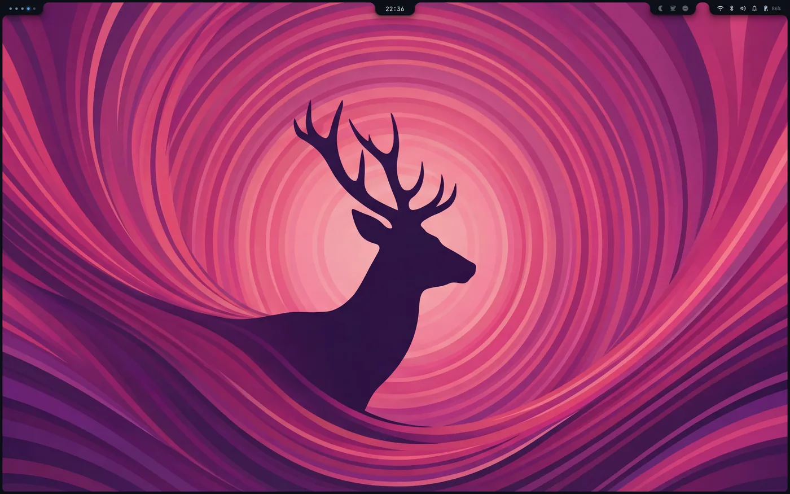
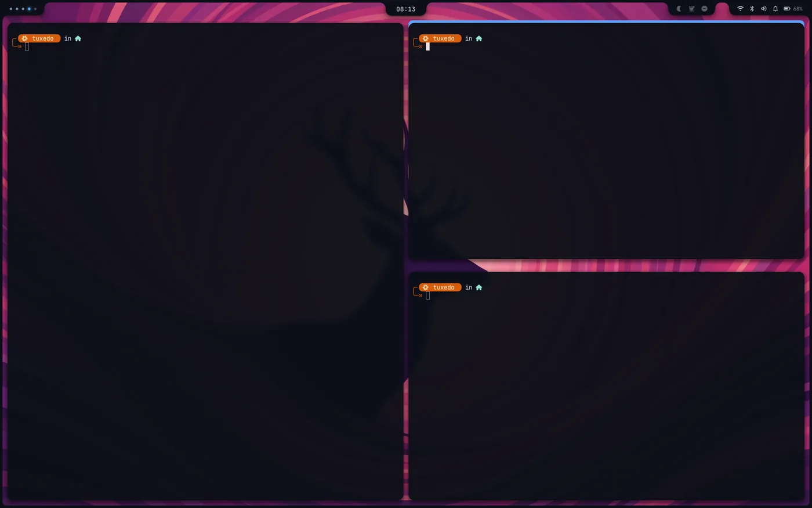
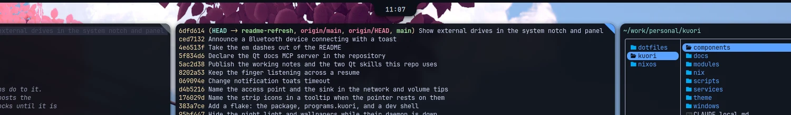
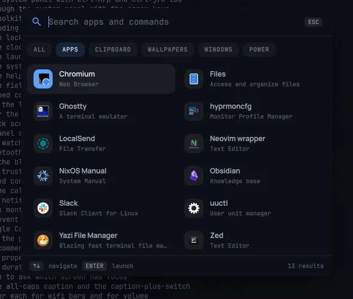
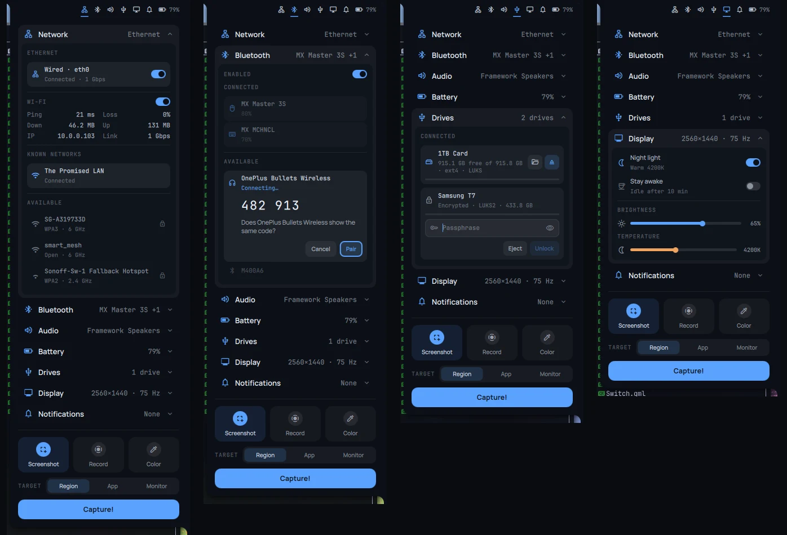
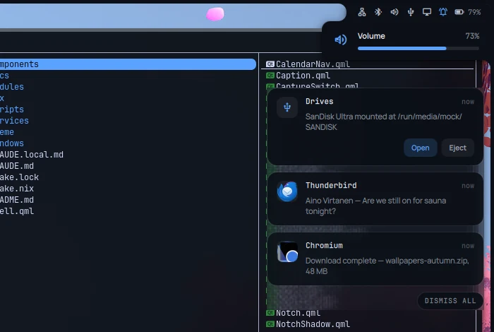
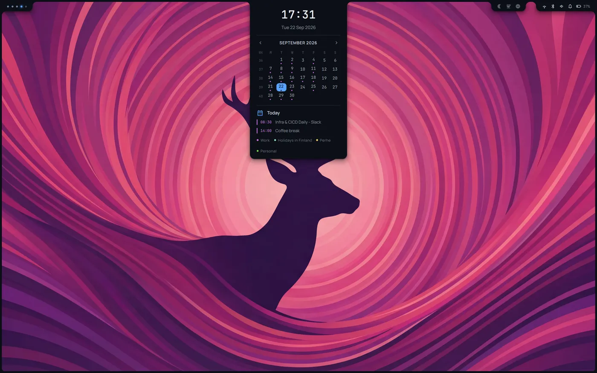

# kuori

A desktop shell for Hyprland, written in [Quickshell](https://quickshell.org) and QML. *Kuori* is
Finnish for shell, husk, envelope.

It draws a border around the whole desktop with tabs ("notches") hanging off the top edge, and
provides an application launcher, a notification daemon, and an authentication agent.

## What it does

- **A frame** around the desktop, with the rounded opening your windows live in.
- **Four notches** on the top edge: workspaces (left), clock and calendar (centre), then the switches
  and the system tab (right). The calendar shows your Google Calendar events.
- **A launcher** with six categories: everything, applications, clipboard history, wallpapers,
  windows and power, each openable straight from a keybind.
- **An on-screen display** for the volume and brightness keys, dropping out of the system tab.
- **Notifications**: kuori *is* the session's notification daemon. Toasts appear top-right, and the
  history lives in the system panel.
- **An authentication agent**: kuori answers polkit, so privileged actions raise its own dialog.
- **A Bluetooth pairing agent**: pairing codes and confirmations appear in the system panel.
- **A focus indicator** on the active window, either a corner wedge or a strip along one edge, and
  the same mark in grey on every other window on screen.
- **A lock screen** that takes a password or a fingerprint. It locks after ten idle minutes, when the lid
  closes and before the machine sleeps, and turns the screen off a minute after locking.

## Screenshots



At rest: the frame around the desktop and the four tabs on the top edge: workspaces on the left, the
clock in the middle, and the switches beside the system tab on the right.



Which window has focus, said by kuori rather than by a window border: a strip along one edge, with
horns at its ends that follow Hyprland's own corner radius. `Theme.focusStripEdge` moves it to the
bottom. Every other window on screen carries the same mark in Hyprland's inactive-border grey;
`Theme.focusMarkUnfocused: false` leaves only the focused one marked. Floating windows carry no kuori
mark: Hyprland reports nothing while a window is dragged, so a mark could not follow one being moved.
They get Hyprland's own border instead, from a `floating-border` window rule in the Hyprland config;
`Theme.focusMarkFloating: true` marks them like any other window.



The same three windows with `Theme.focusStyle: "mark"`: a wedge filling the focused window's
upper-right corner instead. It is the quieter of the two.



The launcher, on applications, with a toast in the corner behind it.



The system tab open, with the display row folded out and the capture block underneath. One row folds
out at a time.



The on-screen display dropping out of the system tab on a volume key, with a toast moving down out of
its way.



The clock tab.

## Requirements

kuori talks to a number of things and degrades quietly when they are missing, so this list is worth
scanning if something looks dead.

| Needed for | What |
|---|---|
| Everything | `quickshell`, Hyprland, a running Wayland session |
| Launching applications | `uwsm` |
| Network details (band, IPv4) | `nmcli` (NetworkManager) |
| Latency reading | `ping` |
| The backlight | `acpilight`, and your user in the `video` group |
| Naming the backlight device | `brightnessctl` |
| Wallpapers | `awww`, and images in `~/Pictures/wallpapers` |
| webp/tiff/jp2 thumbnails | `qt6.qtimageformats` |
| Clipboard history | `cliphist` and `wl-clipboard` |
| Screenshots | `grim`, `slurp`, `grimblast` |
| Screen recording | `wf-recorder` |
| Picking a colour off the screen | `hyprpicker` |
| Every capture's notification | `libnotify` (`notify-send`) |
| Knowing where captures go | `xdg-user-dirs` |
| Night light | `hyprsunset` |
| Calendar events | `python3`, and a Google OAuth client (see *Calendar*) |
| Pairing Bluetooth devices | `python3` with `jeepney`, i.e. `python3.withPackages (ps: [ ps.jeepney ])` |
| Locking at all | the PAM services `kuori` and `kuori-fingerprint` (see *Lock screen*) |
| Locking on lid close and before sleep | `python3` with `jeepney`, as above |
| Applications keeping the screen awake over D-Bus | `python3` with `jeepney`, as above |
| Fingerprint unlock | `fprintd`, and a finger enrolled with `fprintd-enroll` |
| Focusing a window, colour temperature | `hyprctl` |
| Icons in the launcher | any installed icon theme (Adwaita, MoreWaita) |
| Text | `JetBrainsMono Nerd Font` and `Manrope` |
| Every icon and glyph | `Material Symbols Rounded` |

Everything the shell shells out to must be on the **systemd unit's** PATH, which is not your login
shell's. See *Running it*.

**Two features hide while their daemon is not running**, rather than offering a switch that does
nothing:

- **The night light**, without `hyprsunset`: the moon in the toggles tab and the night light switch
  and temperature slider in the display section. kuori asks hyprsunset once a minute and whenever
  that section opens. When hyprsunset comes back, kuori re-applies whatever was saved, since a restarted
  hyprsunset starts at identity.
- **The WALLPAPERS category**, without `awww-daemon`: it is checked each time the launcher opens.
  `launcher wallpapers` opens on ALL instead, and moves to WALLPAPERS if the daemon turns out to be
  back.

The clipboard is never hidden. Without `cliphist`, or without the watchers feeding it, the history is
simply empty. `Theme.unavailableFeatures: "show"` draws everything regardless.

### Companion services

These run as systemd **user** units alongside kuori. Without them the corresponding feature is inert
rather than broken.

| Unit | Why |
|---|---|
| `awww-daemon` | Displays the wallpaper. Its `ExecStartPost` runs `awww restore`, which is what puts your wallpaper back at login. |
| `cliphist-text`, `cliphist-image` | Record the clipboard. `cliphist` is a store, not a daemon: without these there is no history at all. The text one skips anything a password manager marked. |
| `hyprsunset` | Runs with `-i` (identity: present, changing nothing) so the night light has something to talk to. |
| `xdg-user-dirs-update` | Writes `~/.config/user-dirs.dirs` from `/etc/xdg/user-dirs.defaults`, which is how anything (kuori, grimblast, your file manager) knows where Pictures and Videos are. Oneshot at login. |
| `kuori-calendar.service`, `.timer` | Runs `scripts/kuori-calendar sync` every 15 minutes, which writes `~/.cache/kuori/calendar.json` from Google. The clock panel reads that file and nothing else; without the timer it shows whatever was last synced, or "Not synced yet". |

## Installing

### On NixOS, with the flake

The flake carries everything that only matters to kuori: the shell as a user unit, the lock screen's
PAM services, its fonts, the calendar timer, and the tools it runs that talk to no daemon: python
with `jeepney`, `grim`, `slurp`, `grimblast`, `wf-recorder`, `hyprpicker`, `notify-send`, `wl-copy`,
`brightnessctl` and the webp/tiff/jp2 image plugins. None of those need to be in your
`systemPackages`.

What is useful without kuori stays yours to set up: Hyprland, `uwsm`, NetworkManager, bluetooth,
upower, power-profiles-daemon, `acpilight`, and the daemons under *Companion services*. Their clients
(`awww`, `cliphist`) come from your system too, because each has to match the daemon or the database
it talks to.

```nix
# flake.nix
inputs.kuori.url = "github:syvanpera/kuori";
inputs.kuori.inputs.nixpkgs.follows = "nixpkgs";

# in nixosSystem's modules
inputs.kuori.nixosModules.default

# in your configuration
programs.kuori.enable = true;
```

| Option | Default | Does |
|---|---|---|
| `enable` | `false` | installs `kuori` and `kuori-calendar`, and runs the shell as the `kuori` user unit |
| `configDir` | `null` | `null` runs the copy in the package, from `/etc/kuori`. A path such as `"~/.config/kuori"` runs a checkout instead, which reloads on every save, for working on kuori itself |
| `calendar.enable` | `false` | the sync service and its 15-minute timer; set up an account first (see *Calendar*) |
| `lock.enable` | `true` | the `kuori` and `kuori-fingerprint` PAM services |
| `fonts.enable` | `true` | Material Symbols, Manrope and JetBrainsMono Nerd Font |
| `extraPackages` | `[]` | more programs on the shell's PATH |
| `package` | built from your `pkgs` | the package, if you need to override it |

The package's `kuori` is quickshell pointed at the right config, so every command here that says
`qs … -p ~/.config/kuori` can be written without the path: `kuori ipc call launcher toggle`,
`kuori log`. Use it in your keybinds. A rebuild that changes the package restarts the unit.

`nix run github:syvanpera/kuori` runs it once, in the foreground, without installing anything.

### By hand

kuori is a Quickshell config rather than a program you build, so installing it is putting the files
somewhere and pointing Quickshell at them. Everything below assumes `~/.config/kuori`:

```sh
git clone https://github.com/syvanpera/kuori.git ~/.config/kuori
qs -p ~/.config/kuori
```

The second line runs it in the foreground, which is the quickest way to find out whether anything from
*Requirements* is missing. Its complaints go to the terminal, and `Ctrl+C` stops it.

**`-p` names the config for every command**, and it is not optional. Quickshell's own default
directory is `~/.config/quickshell`, so a bare `qs` or `qs ipc` talks to whatever lives there, which
is a different shell, or a stale copy of this one. Keeping kuori outside that directory means nothing
resolves by accident.

### As a systemd user unit

Running it from a terminal is fine for a look, but the shell is also this session's notification
daemon and authentication agent, so it wants to start at login and come back if it dies:

```ini
# ~/.config/systemd/user/kuori.service
[Unit]
Description=kuori desktop shell
PartOf=graphical-session.target
After=graphical-session.target
ConditionEnvironment=WAYLAND_DISPLAY

[Service]
Type=simple

# the absolute path to the binary -- `command -v quickshell` gives it. a bare
# name is resolved against systemd's own compiled-in search path, /usr/bin and
# friends, which on NixOS is not where quickshell lives.
ExecStart=/usr/bin/quickshell -p %h/.config/kuori

# a unit gets systemd's own minimal PATH, not your login shell's. everything in
# Requirements has to be on this one, or it fails silently: the launcher simply
# stops launching, with nothing in the log.
Environment=PATH=/run/wrappers/bin:/run/current-system/sw/bin:/usr/local/bin:/usr/bin:/bin

Slice=session.slice
TimeoutStopSec=5s
Restart=on-failure

[Install]
WantedBy=graphical-session.target
```

```sh
systemctl --user daemon-reload
systemctl --user enable --now kuori
```

On NixOS, use the flake above rather than writing this unit out.

## Running it

```sh
systemctl --user restart kuori      # restart it; never launch a second copy by hand
journalctl --user -u kuori -f       # follow its output
qs log -p ~/.config/kuori           # or quickshell's own log
```

Starting a second instance by hand while the unit is running gives you two shells, each claiming its
own exclusive zone, and a border that reserves twice the space it should.

### Watching the log

Everything kuori prints goes to the unit's journal: QML errors, warnings from the services, and what
its helpers say. The Bluetooth pairing agent's lines are prefixed `bluetooth agent:`.

```sh
journalctl --user -u kuori -f               # follow it live
journalctl --user -u kuori -b               # everything since boot
journalctl --user -u kuori --since "-10min" # the last ten minutes
journalctl --user -u kuori -b | grep -E 'ReferenceError|TypeError'
```

When a panel is inexplicably empty, that last one is the first thing to run: a hot reload that
caught the config mid-change (a `git checkout`, say) leaves bindings failing with `ReferenceError`
and nothing on screen to say so. `systemctl --user restart kuori` clears it.

## Keyboard

Nothing is bound by kuori itself: every entry point is an IPC call, so the binds live in your
Hyprland config. These are the ones this machine uses, from `~/.config/hypr/bindings.lua`:

| Keys | Does |
|---|---|
| `ALT` + `SPACE` | Open the launcher |
| `ALT` + `SHIFT` + `C` | Open it on the clipboard history |
| `SUPER` + `SHIFT` + `S` | Screenshot a region |
| Brightness up / down | One step of the backlight, through kuori itself |
| `SUPER` + `CTRL` + `L` | Lock the screen |

Binding anything else is one more line, and the `-p` goes in every one of them:

```lua
local kuori = "qs ipc -p ~/.config/kuori call "

hl.bind(altMod .. " + SPACE", hl.dsp.exec_cmd(kuori .. "launcher toggle"))
hl.bind(mainMod .. " + N", hl.dsp.exec_cmd(kuori .. "notifications dnd"))
hl.bind(mainMod .. " + W", hl.dsp.exec_cmd(kuori .. "launcher wallpapers"))
```

### Inside the launcher

| Keys | Does |
|---|---|
| `↑` `↓`, `Ctrl+n` / `Ctrl+p` | Move through the results, one at a time, wrapping at both ends |
| `Ctrl+h` `Ctrl+j` `Ctrl+k` `Ctrl+l` | Move over the grid as drawn: left, down a row, up a row, right |
| `Tab` / `Shift+Tab` | Next and previous category chip, wrapping |
| `Page Up` / `Page Down` | Move by whole rows |
| `Ctrl+Home` / `Ctrl+End` | First and last result (bare `Home`/`End` belong to the text caret) |
| `Enter` | Run the selected row |
| `Escape` | Close |

A power row does not run on `Enter`. It raises a confirmation, and while that card is up it owns the
keyboard: the launcher behind it stops answering keys entirely.

| Keys | In the confirmation |
|---|---|
| `←` / `→`, `Ctrl+h` / `Ctrl+l` | Pick Cancel or the action; the one the keyboard is on is lit |
| `Tab` / `Shift+Tab` | The same, toggling |
| `Enter` | Answer with whichever is lit. It starts on the action, as the card says |
| `Escape` | Cancel, leaving the launcher where it was |

### Inside the system panel

| Keys | Does |
|---|---|
| `↑` / `↓`, `Ctrl+n` / `Ctrl+p`, `Ctrl+j` / `Ctrl+k` | Move through the panel in reading order (each row's header, and the switches, entries and power profiles of the row that is folded out), wrapping at both ends |
| `Enter` | What a click would do: fold a row out or away, throw a switch, pick an audio device, join or connect |
| `Escape` | Close the panel |

The first arrow starts inside the row that is already out, so opening the panel on Audio and pressing
`↓` goes straight to its switch and devices. What the keyboard is on wears the same lit look as the
pointer. Sliders and the capture block are mouse only. While a Bluetooth pairing card is up, the keys
are the card's, as described under Bluetooth below.

## IPC

Every call is `qs ipc -p ~/.config/kuori call <target> <function>` (or `kuori ipc call <target>
<function>` with the flake), and `… show` lists them. The path has to be spelled exactly as the
running shell was started with it: `-p .` from inside the directory finds no instance.

### `launcher`

| Call | Does |
|---|---|
| `toggle` | Open or close the launcher, showing everything |
| `open` / `close` | Open showing everything / close |
| `apps` | Open on applications |
| `clipboard` | Open on clipboard history |
| `wallpapers` | Open on wallpapers |
| `windows` | Open on open windows |
| `power` | Open on suspend / reboot / power off |

The category calls **toggle**: pressing the same one twice opens and closes, while pressing a
different one while the launcher is open switches category without closing it.

### `calendar`

| Call | Does |
|---|---|
| `toggle` | Open or close the clock tab's calendar |

### `system`

| Call | Does |
|---|---|
| `toggle <row>` | Open the system panel on `wifi` (the network row), `bluetooth`, `audio`, `battery`, `display` or `notifications`; the same row again closes it |

### `notifications`

| Call | Does |
|---|---|
| `dnd` | Toggle Do Not Disturb |
| `clear` | Throw away the history |
| `dismiss` | Dismiss every toast currently on screen |

### `capture`

| Call | Does |
|---|---|
| `region` | Screenshot a region you drag out |
| `app` | Screenshot the active window |
| `monitor` | Screenshot the whole monitor |
| `record <target>` | Start recording `region`, `app` or `monitor`; empty uses whatever the panel shows |
| `stop` | Stop the recording and finalise the file |
| `color` | Pick a colour off the screen and copy it |

`Print` is the obvious bind for `region`.

### `polkit`

Walks the authentication dialog through each state it can be in, against a mock request, so it can be
looked at without a real one. `close` puts it away.

| Call | Does |
|---|---|
| `prompt` | Raise the dialog, waiting for a password |
| `busy` | Show it verifying |
| `error` | Show a refused attempt |
| `ok` | Show it accepted |
| `close` | Dismiss it |

A real request from polkit raises the same dialog on its own; nothing here is needed for that.

### `bluetooth`

Fakes each question the pairing agent can ask, against the first device in AVAILABLE, so the cards
can be looked at without a device that wants pairing, and the toast a connection raises. Open the
section first with `system toggle bluetooth`. Answering one goes nowhere: the real agent has no question waiting.

| Call | Does |
|---|---|
| `mock confirm \| compare \| type \| pin \| incoming` | Raise that card |
| `typed <n>` | Light the first `n` digits of a `type` card |
| `cancel` | Show the card being called off from the device's side |
| `fail` | Show "Could not pair" on the row |
| `mock connected \| disconnected` | Raise the toast a device coming or going would, for the first connected device |

### `lock`

| Call | Does |
|---|---|
| `now` | Lock the screen |
| `preview <scene>` | Show the lock screen **without locking anything**, in one of its states: `rest`, `typing`, `verifying`, `wrong`, `long`, `caps`, `finger`, `fingerfail`, `fingerok`, `secondary`. `close` puts it away, and so does Escape on the bare clock |

Bind `now` to whatever key locks for you. `Super+L` is taken by focus-right here:

```lua
hl.bind(mainMod .. " + CTRL + L", hl.dsp.exec_cmd("qs ipc -p ~/.config/kuori call lock now"))
```

`loginctl lock-session` locks it too. The preview's password field is real: a wrong password there is
refused by PAM exactly as it would be on the lock, and the right one closes it.

### `display`

| Call | Does |
|---|---|
| `night` | Toggle the night light |
| `awake` | Toggle the idle inhibitor |
| `temperature <K>` | Set the colour temperature, 2500–6500 |

### `backlight`

| Call | Does |
|---|---|
| `up` / `down` | One step of the screen brightness, 5 points of the real range |
| `level` | Print the current percentage |

Bind these to the brightness keys and one press is one step of the scale the panel and the OSD show:

```lua
hl.bind("XF86MonBrightnessUp",   hl.dsp.exec_cmd("qs ipc -p ~/.config/kuori call backlight up"),   { locked = true, repeating = true })
hl.bind("XF86MonBrightnessDown", hl.dsp.exec_cmd("qs ipc -p ~/.config/kuori call backlight down"), { locked = true, repeating = true })
```

`brightnessctl`'s own percentages are **not** this scale. Its `-e4` moves 5% along a gamma-4
perceptual curve, which from 56% steps to 44, 34, 26, 19, 14, each press a different amount of the
range the readings report. A bare `brightnessctl set 5%-` is linear and would agree with these
readings too; going through kuori also writes sysfs directly instead of starting a process per press,
and stops at 1% so a key held one press too long cannot leave a dark screen.

## The notches

**Workspaces** (left) opens on hover, since it has nothing to click. The others latch open on a
click, and a click anywhere else closes them.

**With more than one monitor**, `tabScreens` in `theme/Theme.qml` decides where the tabs go:

- `"main"` (the default): the tabs, their panels and the on-screen display are on the **main
  monitor**, which is the one workspace 1 is on. Hyprland has no primary monitor, and your own
  workspace rules already say which screen that is. Every other monitor keeps the border alone, and
  windows get the band the tabs would have hung in. A keybind or an IPC call (`calendar toggle`,
  `system toggle <row>`) opens its panel on the main monitor wherever you are working.
- `"all"`: every monitor has its own copy of every tab. Keybinds and IPC calls open on the focused
  monitor, and the on-screen display appears there.

Either way only one panel is open at a time, on the screen it was opened from. The same tab on another
screen moves the panel there rather than opening a second one, and unplugging the monitor a panel is
on closes it. The launcher, the polkit dialog and the toasts appear on the focused monitor. Unplugging that monitor closes the launcher and moves the other two to whichever
monitor is focused then; plugging one in, or unplugging a different one, leaves them where they are.

**Clock** (centre) opens a calendar. The month arrows page; the date line is clickable to come back
to today, but only when you have paged away from it. Clicking the time again closes the panel.

A day with something on carries a dot per calendar, in each calendar's colour, and clicking it lists
that day's events under the grid: a bar and the time in the calendar's colour, all-day events first
with a dash for a time, and `+N more` past four. A legend under the list says which colour is which;
an account's primary calendar is named after the account. It opens on today. Paging the month drops the pick, and an
empty day cannot be picked. Under the header, "No events" means exactly that; "Not synced yet" means
no sync has ever run, and "Not synced this far" means the month on screen is outside what the last
sync fetched (the month before this one to six months ahead).

Opening the tab re-reads the file, and if it is older than five minutes starts the sync unit as
well, so what you see is at most a few minutes behind Google while you are looking and costs
nothing while you are not.

**Toggles** (right, just left of the system tab) is three switches and nothing else: a moon for the
night light, a cup for the idle inhibitor and a crossed circle for Do Not Disturb. Each is accent
while on and dim while off, and a click toggles it. The cup is also lit while an application is
keeping the screen awake over D-Bus (a video playing, say), though its switch is still off, and the
Display section's Stay awake row says who ("Held by …"). The tab steps out of the way while the system
panel is open or the on-screen display is out, both of which grow over it.

**System** (far right) shows the network, Bluetooth, volume, display, notifications and battery, and a red dot while
a recording is running. It opens a panel of rows, one folded open at a time:

- **Network**: Ethernet first, then Wi-Fi. A connected cable wins: the strip shows a wired glyph,
  and the readings (IPv4, traffic, link speed, latency) describe the wire rather than the radio. Each
  Ethernet port has a switch that disconnects it and stays off until switched back on, even across
  re-plugging; the switch is greyed out while no cable is in. The Ethernet section only appears when
  the machine has a wired interface, a USB adapter or dock included. Under it are the Wi-Fi switch and
  the known and available networks. Clicking an open network joins it with **no confirmation**.
- **Bluetooth**: paired devices first. A device that has stopped advertising will refuse to connect;
  the row says so rather than looking dead. Clicking a device that was never paired pairs it, trusts
  it so it reconnects by itself, then connects. Whatever the device wants on the way opens as a card
  under its row: a yes or no for a mouse or headphones, a code to compare for a phone, a code to type
  on a keyboard (its digits light up as you type them), or a field for a PIN. A device that starts
  pairing by itself asks to be allowed. Enter picks the ringed button, Tab or the arrows move the
  ring, Escape cancels. While the panel is not showing Bluetooth, the question appears as a toast;
  clicking it opens the section. kuori is the session's pairing agent, through
  `scripts/kuori-btagent`, which it runs itself. `bluetoothctl` and `bluetui` register their own
  while they are open, and take the questions until they close.
  A device connecting raises a toast with its glyph, name and charge ("Connected — MX Master 3S ·
  80%"). There is none for a device you just clicked in the panel, and none for ten seconds after
  kuori starts, the machine wakes or the radio comes on, when every paired device reconnects at once.
  They are transient, so they never reach the history or light the bell. `Theme.btAnnounce` picks
  `"connect"`, `"both"` to hear about disconnects too, or `"off"`.
- **Audio**: output and input devices, volume, and a switch that is mute read the right way up.
- **Battery**: level, time remaining, health, rate, and power profiles when a daemon offers them.
- **Display**: night light, stay awake, brightness, and a colour temperature slider that appears
  while the night light is on.
- **Notifications**: the Do Not Disturb switch and the history.

**Every icon on the system tab is a button.** Clicking one opens the panel with that row already
folded out, and the icon is accented and underlined for as long as it is the row you are looking at;
clicking it again closes the panel. A click on the gap between icons opens and closes the panel
without choosing a row.

The bell is the exception in one way: it is accent whenever anything is in the history, whether or not
its section is open, and its glyph changes with it. Clicking it opens the history. It does not
silence anything and does not clear anything. Do Not Disturb is the switch on the toggles tab, and
`CLEAR` in the notifications row is what empties the history.

The red recording dot reports only; it is the one thing on the tab that opens nothing.

**Resting the pointer on an icon names it**, on both the system and the toggles tab, after a little
over half a second. Sliding along to the next icon names that one at once. A switch says which way it
is set and what a click will do ("Night light off — click to turn on"), and the words change under
the pointer when you click. The network icon names the access point you are on, or says "Ethernet" and the
link speed on a cable; the volume icon names the output it is playing through, and says when it is
muted. The cup says whose hold is lighting it when that is an application's. No
name appears while a panel is open or the on-screen display is out.

Panels only do work while they are open: the Wi-Fi scan and the latency probe both stop when their row
folds away.

### The on-screen display

Press a volume or brightness key and a box drops out of the system tab with the glyph, the name, the
percentage and a bar. It follows further presses and takes itself away 1.7 seconds after the last one.
Muted says `Muted` and `—`, with the bar at nothing in grey rather than accent.

**It does not need to be what your keys are bound to.** kuori watches the two values rather than the
keys: pipewire reports volume, udev reports the backlight. So the display answers a change made by
`wpctl` from a volume key, by `brightnessctl` in a terminal, or by anything else on the machine, and
it would work with no change to your Hyprland config at all. (The brightness keys here do go through
kuori, but for a different reason: see `backlight` above.)

Toasts move down while it is out, and it stays away entirely while the system panel is open, since the
panel is showing those same sliders. With several monitors it appears on the focused one only.

## Notifications

kuori answers `org.freedesktop.Notifications`. **Nothing else on the machine does**, so while kuori
is down notifications are not merely undrawn. They are dropped.

- Up to four toasts, newest at the top, each gone after about five seconds.
- **Clicking a toast dismisses it and drops it from the history**: you read it, so there is nothing
  to come back to. Buttons on it are the sender's own actions and do the same; the first is
  accented because it is the one the sender listed first.
- **Critical notifications do not time out.** They stay until dismissed.
- Toasts stand aside while the system panel is open, since they share that corner.
- **Do Not Disturb silences the toasts only.** A muted notification still lands in the history, which
  is the only place you would find out it arrived.
- The history keeps the last 50: what expired unread, what arrived under Do Not Disturb, and what
  `DISMISS ALL` swept away. Clicking an entry forgets it; `CLEAR` empties the lot, and takes any
  toast still on screen with it. Anything a sender marked *transient* (volume popups and the like)
  is never kept.
- The bell on the system tab is accent while there is anything in the history. Clicking it opens the
  history; `CLEAR` inside that section is what empties it.

## Calendar

The events come from Google Calendar, from every calendar you have ticked in Google's own sidebar,
across as many Google accounts as you sign in. Working-location entries and events you have declined
are left out. A calendar shared into two of your accounts appears once.

Nothing in the shell talks to Google. `scripts/kuori-calendar` does, on the `kuori-calendar.timer`
(see *Companion services*), and writes `~/.cache/kuori/calendar.json`. Setting it up once:

1. In [Google Cloud Console](https://console.cloud.google.com/), create a project, enable the
   **Google Calendar API**, and under *Credentials* create an **OAuth client ID** of type **Desktop
   app**. Note the client ID and secret, or download the client JSON.
2. For each Google account, run the consent once, signing in as that account when the browser asks:

   ```sh
   scripts/kuori-calendar auth personal            # prompts for the client id and secret
   scripts/kuori-calendar auth work client.json    # or reads them from the downloaded file
   ```

   With the flake it is `kuori-calendar auth personal`, from anywhere. The account names are yours
   to choose; they only label the token. The refresh tokens land in
   `~/.local/state/kuori/google-oauth.json`, mode 0600. Keep that file out of any repository.
3. `scripts/kuori-calendar sync`, or `systemctl --user start kuori-calendar`, and open the clock tab.

**A Google Workspace account** may be barred by its admin from apps that are unverified or still in
"testing". If the consent page says so, create the OAuth client in a project owned by *that* account
and mark it **Internal** under *OAuth consent screen* (internal apps need no verification), and use
that client for that account. Each account keeps its own client, so mixing is fine.

`journalctl --user -u kuori-calendar` is where a failed sync explains itself. One account failing
does not stop the others; the file is only left untouched when every account fails.

## Wallpapers

Images live in `~/Pictures/wallpapers`: jpg, png, webp, gif, bmp, tiff and jp2. The launcher's
wallpaper category lists them with thumbnails, marks the one on screen, and offers a random pick that
never lands on the one already showing. A file dropped into the folder appears without a restart.

`awww` keeps its own cache of the last image, and its unit restores it at login, so kuori does not
remember your wallpaper for it.

## Clipboard

Everything copied goes to `cliphist`. The launcher's clipboard category lists it newest first, with
an icon for the kind of entry: text, a link, an image, or a swatch of the colour when the entry is a
hex code. Choosing one puts it back on the clipboard, ready to paste; it does not type it for you.
`Clear clipboard history` at the bottom wipes the store.

Selecting an entry shows a **preview** under the list: the whole text rather than the truncated line,
an image drawn on a chequerboard so transparency reads as transparency, or a colour as a swatch beside
its value. The footer gives the size, and the dimensions and format for an image.

Anything a password manager marked with `x-kde-passwordManagerHint` is **never recorded**.

## Capture

The block at the foot of the system panel: pick **Screenshot**, **Record** or **Color**; for the first
two pick a target (Region, App or Monitor) and press **Capture!**.

- **Screenshots are saved and copied at once**, so the file is kept *and* ready to paste.
- The pointer becomes a **crosshair** while you are selecting, for every target.
- **Region** drags a rectangle. **App** dims the screen and lets you click the window you want, not
  whichever happens to be focused. Only windows actually on screen are offered. **Monitor** does the same for screens, and skips the picker when
  there is only one, since there is nothing to choose.
- **Where they go is not kuori's decision**: `XDG_SCREENSHOTS_DIR` then `XDG_PICTURES_DIR` from
  `~/.config/user-dirs.dirs`, which on this machine means `~/Pictures/Screenshots`. Recordings go to
  `XDG_VIDEOS_DIR`. Change the file and everything follows, including other tools.
- Every capture announces itself with a notification, and a screenshot's notification carries the
  screenshot as its thumbnail.
- **A recording shows a red dot** on the system strip until you stop it, and the button reads
  `Recording…`. Press it again, or `qs ipc … call capture stop`, to finish.

**Color** freezes the screen, magnifies whatever is under the pointer, and copies the colour you click
in the format you chose: HEX, RGB or HSL. The panel keeps the last one with a swatch, and it lands in
the clipboard history as a colour entry too.

Recording adds one switch, **Record microphone**, off by default. Desktop sound is not offered:
wf-recorder takes a single audio device and mixing two needs a virtual source nothing here builds.

Two things worth knowing:

**Encoding is hardware when a VAAPI driver is loadable, software otherwise**, and the notification
says which you got. The check is whether a driver sits in `/run/opengl-driver/lib/dri`. A driver
merely installed into `environment.systemPackages` is invisible to libva; it has to be in
`hardware.graphics.extraPackages`. wf-recorder exits rather than falling back, so the shell only asks
for hardware when it can see a driver. It looks once at startup, so a driver installed while kuori is
running is picked up after `systemctl --user restart kuori`.

**Restarting the shell ends a recording**, since the recorder is its child process.

## Lock screen

The screen **locks** after ten minutes with nobody at the keyboard, when the lid closes (even while
docked, when closing it does not suspend), before the machine goes to sleep, on `loginctl
lock-session`, and on `lock now`. Once locked, the screen **goes off** after another minute idle and
comes back on at the first key or movement. Anything that inhibits idle (the **Stay awake** switch, a
playing video) holds off both. That includes an application asking over D-Bus, directly or through
the portal: kuori owns `org.freedesktop.ScreenSaver` through `scripts/kuori-screensaver`, which it
runs itself, so no idle daemon is needed.

At rest it is the clock and the date over your wallpaper, blurred. The first key you type brings up
the prompt *and* is typed into it; a click does the same without typing anything. Escape puts the
prompt away again. On a second monitor it is the clock alone, dimmed; the prompt is on the monitor
the keyboard is on.

**A finger on the sensor unlocks it too**, with no need to open the prompt first. A touch brings the
prompt up, so a finger it does not know is shown being refused. The line saying so
only appears once `fprintd` is actually listening. With no finger enrolled it never does, and the
password is the only way in. Enrol one with `fprintd-enroll`.

It needs two PAM services, one for each way in, because a single stack asks them in turn: with the
fingerprint first, a typed password would sit unread for up to thirty seconds. The flake's module
declares them (`programs.kuori.lock`); by hand on NixOS they are:

```nix
security.pam.services.kuori = { fprintAuth = false; };
security.pam.services.kuori-fingerprint = { unixAuth = false; fprintAuth = true; };
```

**kuori refuses to lock without `/etc/pam.d/kuori`**, and says so in the log: a lock with nothing
behind it could only be escaped from a TTY.

**If the shell crashes while locked, the screen stays locked.** Hyprland keeps the session locked when
its lock client dies, and the restarted shell takes the lock back up (with
`misc:allow_session_lock_restore = true` in Hyprland's config). Nothing that restarts or kills kuori
opens the lock, and there is deliberately no IPC call that does. If it ever comes to that, a TTY
(`Ctrl+Alt+F3`) and `systemctl --user restart kuori` brings the prompt back.

## Configuration

There is no config file: this is a shell you edit. Almost everything lives in `theme/Theme.qml`:
every colour, size, duration and font in one place.

| Want to change | Look at |
|---|---|
| Colours, sizes, animation timing | `theme/Theme.qml` |
| Focus indicator style | `Theme.focusStyle` (`"mark"` or `"strip"`), `Theme.focusStripEdge`; `Theme.focusMarkUnfocused`, `focusUnfocusedBase` and `focusUnfocusedOpacity` for the other windows; `Theme.focusMarkFloating` for floating ones |
| How long a toast lasts, how many stack | `Theme.toastTimeout`, `Theme.toastMax` |
| Whether a Bluetooth device connecting raises a toast, and going too | `Theme.btAnnounce` (`"connect"`, `"both"` or `"off"`), `Theme.btAnnounceSettle` |
| Colour temperature range | `Theme.dispTempMin` / `dispTempMax` / `dispTempDefault` |
| Where wallpapers come from | `Wallpapers.directory` in `services/Wallpapers.qml` |
| What the latency reading pings | `Network.pingTarget` in `services/Network.qml` |
| How far the calendar fetches, how often | `MONTHS_BACK` / `MONTHS_AHEAD` in `scripts/kuori-calendar`; `OnUnitActiveSec` in the timer |
| How old the calendar may be when the tab opens before it re-syncs | `Theme.calSyncStale` |
| How many events a day lists before `+N more` | `Theme.eventMax` |
| How many clipboard entries the launcher shows | `cliphist`'s own `-max-items` |
| How long before it locks, and then how long before the screen goes off | `Theme.lockIdle`, `Theme.lockBlank`, in seconds |
| Whether applications may hold idle off over D-Bus | `Theme.appInhibit` (they are still answered when false) |
| Whether a feature whose daemon is down hides | `Theme.unavailableFeatures` (`"hide"` or `"show"`) |
| Whether strip icons name themselves on hover, and how soon | `Theme.stripTips`, `Theme.tipDelay` |
| Where captures are written | `~/.config/user-dirs.dirs`, not kuori |

State that has to survive a restart (the night light and its colour temperature, and whether the
screen is locked) is written to `~/.local/state/quickshell/by-shell/<id>/`, as `display.json` and
`lock.json`. Stay awake deliberately does not:
an idle inhibitor is invisible, and one silently restored after a restart is a flat battery nobody can
explain.

## Layout

```
shell.qml       the root: one shell per screen, plus the launcher, the polkit
                dialog, toasts and IPC
windows/        surfaces: which windows exist and what each is for
components/     reusable pieces with no domain knowledge
modules/        the contents of a tab, a panel or a dialog
services/       singletons: shared state, and everything that talks to the system
theme/Theme.qml every colour, size, duration and font
scripts/        what runs outside the shell: the calendar fetcher, and the bluetooth
                pairing agent the shell starts itself
```
